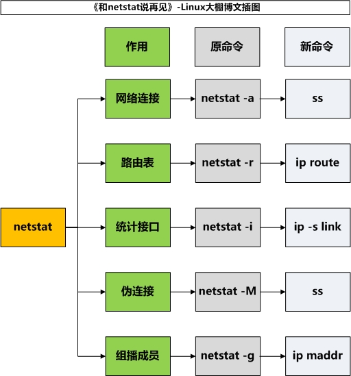

###netstat命令
man netstat: This  program  is obsolete.  Replacement for netstat is ss.  Replacement for netstat -r is ip route.  Replacement for netstat -i is ip -s link.  Replacement for netstat -g is ip maddr. Replacement for route is ip route.

